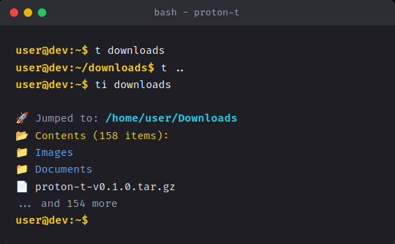

# Proton-T
[](https://www.rust-lang.org/)
[](https://crates.io/crates/proton-t)
[](https://opensource.org/licenses/MIT)

**Proton-T is a smarter `cd` command**

It learns which directories you use most frequently, so you can "jump" to them in just a few keystrokes. Proton-T works on all major shells and uses a smart Frecency + Intent matching algorithm to understand your workflow.



[Live Website](https://pheem49.github.io/Proton-T/) • [Getting started](#getting-started) • [Installation](#installation) • [Configuration](#configuration)

---

## Getting started

Proton-T uses simple commands to jump into directories or manage your database.

### Usage Table

| Command | Action | Description |
|:---|:---|:---|
| `t <query>` | Jump to match | cd into highest ranked directory matching keywords |
| `t project` | Jump to project | cd into the highest ranked developer workspace |
| `t backend` | Tag mapping | cd into directories tagged 'api', 'server', 'node', etc. |
| `t ..` | Go up | cd one level up |
| `t -` | Go back | cd into previous directory |
| `t <query><TAB>`| Tab completion | Autocomplete directory names from your database |
| `ti` | Interactive menu | Show interactive numbered menu of suggested projects and recent paths |
| `ti <query>` | Interactive search | cd with interactive selection matching the query |
| `proton-t list` | View rankings | View current directory rankings |
| `proton-t clean` | Clean database | Remove invalid/deleted directories from the tracking database |
| `proton-t remove <path>`| Remove path | Remove a specific path from the database |

### Examples

```bash
t foo              # Jump to the best match for 'foo'
t foo bar          # Add multiple keywords to narrow it down
t recent project   # Use intent keywords to jump to exactly what you need

ti                 # Forgot the name? Just type ti to browse your active paths
```

*Read more about the matching algorithm [here](#matching-algorithm).*

---

## Installation

Proton-T can be installed easily across OSes. 

### 1. Install Script (Recommended)

**Linux / macOS / WSL (Bash/Zsh/Fish)**
```bash
curl -sSfL https://raw.githubusercontent.com/Pheem49/Proton-T/main/install.sh | sh
```

**Windows (PowerShell)**
```powershell
iex (Invoke-RestMethod https://raw.githubusercontent.com/Pheem49/Proton-T/main/install.ps1)
```
> [!NOTE]
> On Windows, you might need to run: `Set-ExecutionPolicy RemoteSigned -Scope CurrentUser` before running the installer script.

### 2. Manual Installation via Cargo (Crates.io)

If you have Rust installed on your machine, you can install Proton-T directly from crates.io:
```bash
cargo install proton-t
```
*(Alternatively, if installing from a local clone, run: `cargo install --path .`)*

### 3. Setup Proton-T on your shell

*Note: If you used the install scripts above, this step is handled automatically.*
Proton-T requires shell integration to track your directory history and provide the `t` and `ti` commands. 

**Bash / Zsh** (`~/.bashrc` or `~/.zshrc`)
```bash
# Add this to the end of your config file
eval "$(proton-t init bash)"  # or zsh
```

**Fish** (`~/.config/fish/config.fish`)
```fish
proton-t init fish | source
```

**PowerShell** (`$PROFILE`)
```powershell
proton-t init powershell | Out-String | Invoke-Expression
```

> [!IMPORTANT]
> **Why use `init`?** 
> The `init` command is essential for Proton-T's **Frecency Engine**. It overrides the default `cd` behavior to automatically track and rank every directory you visit. Without this, the ranking algorithm won't have the data it needs to stay accurate.

---

## Configuration

### Environment Variables

Environment variables can be used for temporary configuration. They must be set in your shell:

- `_PT_ECHO`
  When set to `1`, `t` and `ti` will print the matched directory before navigating to it.

### Configuration File (`config.json`)

Proton-T automatically creates a configuration file at `~/.config/proton-t/config.json` after its first run.
You can open and edit this JSON file to customize its behavior:

| Key | Description | Default |
|:---|:---|:---|
| `search_roots` | Common directories to fallback onto when scanning for new paths. | `["~", "~/Downloads", "~/Documents", "~/Desktop"]` |
| `max_entries` | The maximum number of history entries allowed to prevent bloat. | `1000` |
| `exclude_list` | Globs and folder names to completely ignore. | `[".git", "node_modules", ".venv", "__pycache__"]` |
| `project_markers` | Files that signal that a directory is a workspace/project. | `["package.json", "Cargo.toml", ".git"]` |

---

## Matching Algorithm

Proton-T is designed to calculate intents, not just matching strings.

- **Frecency Engine:** Calculates the balance between frequency and recency. It ages gracefully, prioritizing active projects over forgotten ones.
- **Intent Engine:** Speak to your terminal. `t recent project` computes "What was that project I touched yesterday?" and instantly jumps there.
- **Project Awareness:** Projects (detected via `project_markers`) receive a **1.2x** algorithm boost naturally over regular folders.
- **Smart Fallback Discovery:** Never visited a folder? Proton-T scans your common `search_roots` breadth-first to find and bookmark matching new directories on the fly.
- **Tab Completion:** Pressing Tab after `t` keywords will suggest matching directory names based on your history and search roots.
